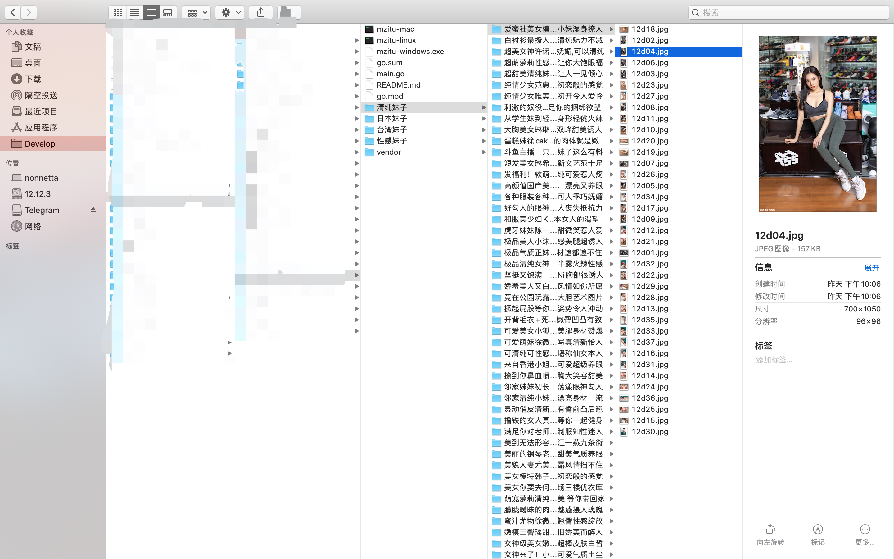

# 妹子图爬虫

#### 一、介绍
纯属无聊，在学习colly的过程中试了下水，在爬取过程中还和站长斗智斗勇，感觉蛮有意思的。
爬取速度太快，会被封ip，还有图片下载如果不加referer，会下到一张"请勿盗链"的默认图片。

#### 二、架构
本项目主要采用colly进行爬取，colly 是 Go 实现的比较有名的一款爬虫框架，而且 Go 在高并发和分布式场景的优势也正是爬虫技术所需要的。它的主要特点是轻量、快速，设计非常优雅，并且分布式的支持也非常简单，易于扩展。

#### 三、食用指南
##### 1. 自行下载编译执行
```
git clone https://github.com/pwh19920920/go-colly-mzitu
go mod init mzitu
go mod vendor
```

如果安装依赖包速度慢可以参考以下文章

[使用goproxy的方式解决go语言go get无反应，github包下载慢问题](https://my.oschina.net/pwh19920920/blog/3137323)

##### 2. 使用已编译来执行
```
mzitu-linux
mzitu-mac
mzitu-windows.exe
```

#### 四、成果图



#### 五、colly学习资料

1. [Go 爬虫之 colly 从入门到不放弃指南](https://juejin.im/post/6844903906078801934)
2. [Colly 官方文档学习从入门到入土](https://www.ulovecode.com/2020/04/28/Go/Colly%E5%AE%98%E6%96%B9%E6%96%87%E6%A1%A3%E5%AD%A6%E4%B9%A0%E4%BB%8E%E5%85%A5%E9%97%A8%E5%88%B0%E5%85%A5%E5%9C%9F/)


#### 六、特别声明
此爬虫仅供学习使用，不得用于商业用户，侵删！